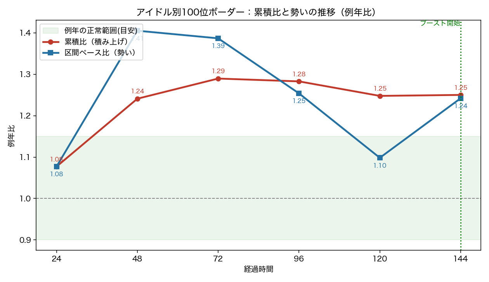
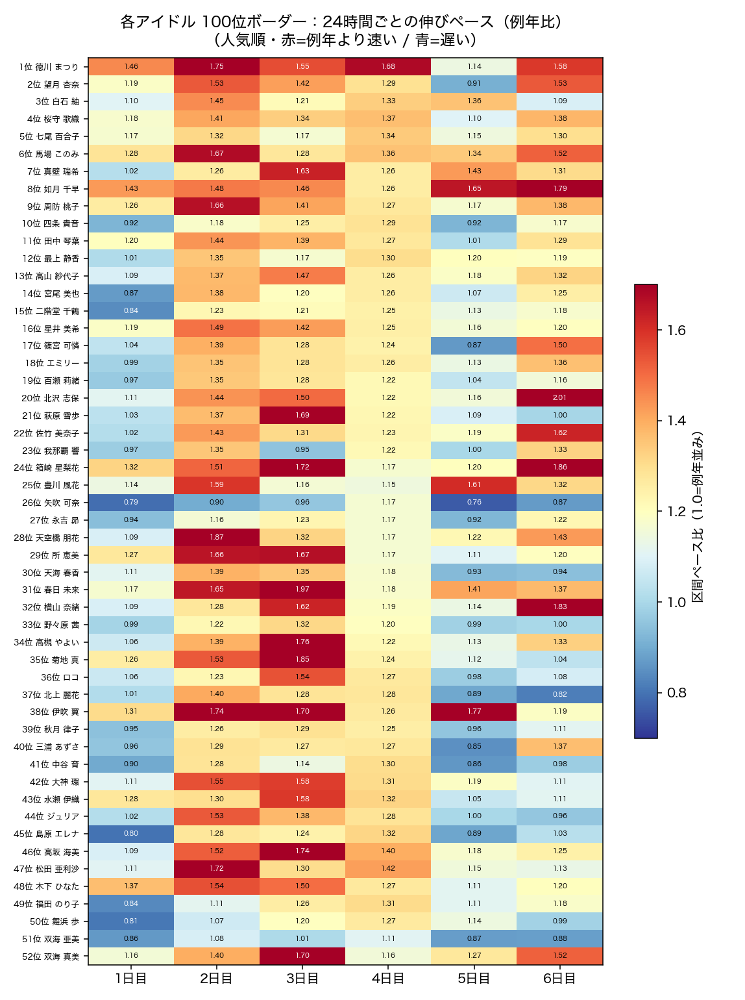
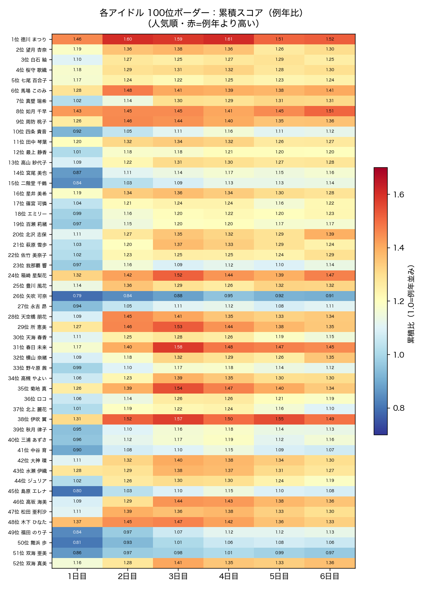
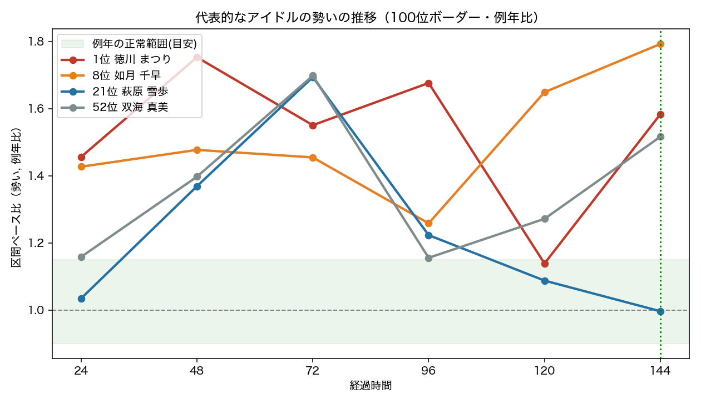
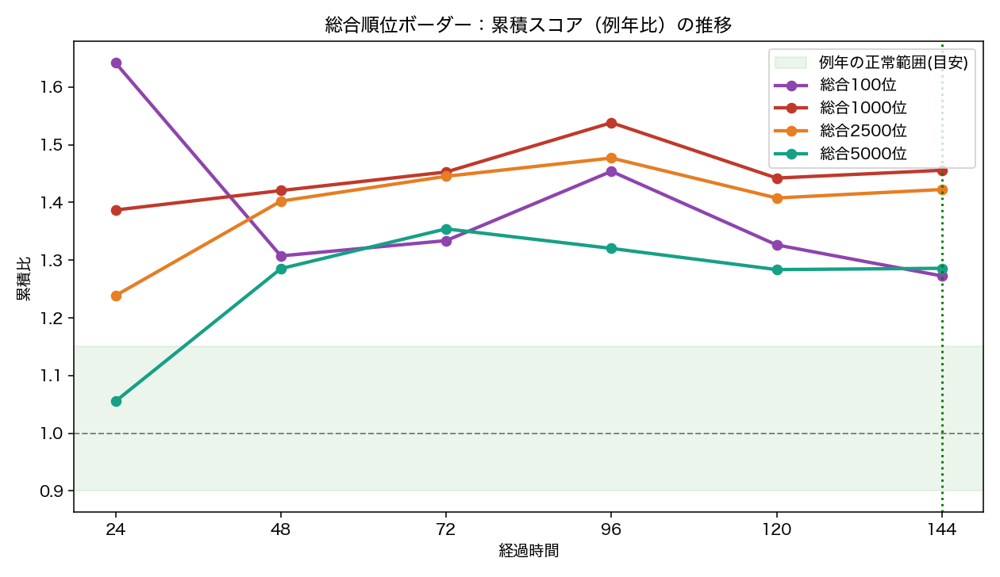
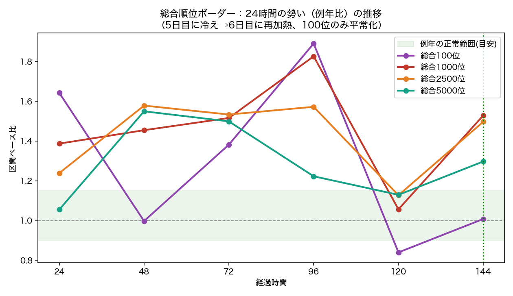
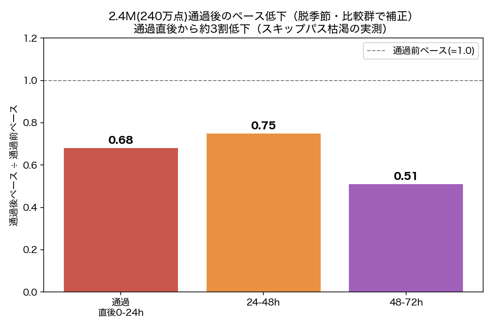

# ９周年イベント スコア動向と予測改善レポート（最初の144時間）

このレポートは、９周年イベントについて「最初の6日間（144時間＝ブースト開始時点）で
何が起きていたのか」「なぜ従来どおりの予測だと当たりにくいのか」「それに対して予測の
仕組みをどう直したのか」を、図を交えて順を追ってご説明するものです。

専門的な用語はできるだけ避け、必要なものは最初にかみ砕いて説明します。

---

## 0. はじめに：このレポートで使う言葉

後で出てくる言葉を、日常のイメージで説明します。

- **例年（過去クラウド）**
  過去の同じ周年イベントで「同じ経過時間のとき、各ボーダーがどのくらいのスコアだったか」を
  集めたものです。今回はアイドル別100位で**過去6回**、総合順位で**過去5回**の周年イベントを
  基準にしています。真ん中が「例年並み」、上下の幅が「例年のブレの範囲（正常範囲）」です。

- **累積比（るいせきひ）**：「今回の累積スコア ÷ 例年の同時期スコア」。
  **1.0＝例年並み、1.25＝例年より25%高い**。“これまでに積み上がった合計スコア”のイメージです。

- **区間ペース比（勢い）**：「直近24時間で伸びた量 ÷ 例年の同時期24時間で伸びた量」。
  **“今の勢い”が例年の何倍か**。“今月の稼ぎのペース”のイメージです。

- **曜日・段階の調整**：土日やブースト日など、仕組み・曜日による自然な上下をならして、
  純粋な勢いだけを公平に比べる処理。以下の数字はすべて調整済みです。

- **ボーダーの種類**：**アイドル別100位**（各アイドルの100位ライン。本予測の主対象）と、
  **総合順位（100/1000/2500/5000位）**（全体の順位ライン）。

図の見方：緑の帯が「例年の正常範囲の目安」、緑の点線が「ブースト開始（144時間）」です。

---

## 1. 状況整理：９周年イベントは何が「いつもと違う」のか

本イベントの一番の特徴は、期間限定の**「スキップパス」**です。

- 過去イベントの追加プレー権は「オートパス（約160秒/曲）」でした。
- 本イベントでは同じ付与枚数が「スキップパス（約20秒/曲＝約1/8の時間）」になりました。

もらえる枚数や1プレーの得点は同じですが、**1回が短く済むぶん、同じ時間でたくさん回せる**
ようになりました。結果として、(1) 序盤からスコアが例年より大きく上振れ、(2) 例年なら
「ブースト前日に温存する」ところを**本イベントは温存せず走り続けた**、という動きになりました。
**例年基準のままだと予測が過大になりやすい**、というのが出発点の課題です。

---

## 2. 観測①：アイドル別100位ボーダー（例年比）

| 経過時間 | 24h | 48h | 72h | 96h | 120h | **144h** |
|---|---|---|---|---|---|---|
| **累積比** | 1.08 | 1.24 | 1.29 | 1.28 | 1.25 | **1.25** |
| **区間ペース比** | 1.08 | 1.41 | 1.39 | 1.25 | 1.10 | **1.24** |

- 累積比は**1.25倍前後で高止まり**（例年より約25%高い水準が継続）。
- 勢いは序盤に強く伸び、**5日目にいったん1.10倍まで沈静化**した後、**6日目に1.24倍へ再上昇**。
- 一度「勢いが落ちてきた＝これから減速」と見えましたが、これは**1日限りの中だるみ**で、
  実際には6日目に持ち直しました（後述）。

### 2-1. アイドルごとの内訳（ヒートマップ）

行がアイドル（上＝人気・スコア上位）、列が1〜6日目、色が濃い赤ほど「例年より速い/高い」です。

**24時間ごとの勢い（区間ペース比）**

**累積スコア（累積比）**

読み取り：
- 累積（下図）は**ほぼ全アイドル・全日程で赤（>1.0）**＝どの層も例年より積み上がっています。
- 勢い（上図）は、**5日目の列がやや冷え、6日目の列が再び広く赤**に戻っています。
  6日目の再加熱は一部のトップだけでなく、**裾野まで広く及んでいる**ことが分かります。

### 2-2. 代表的なアイドル

| アイドル（人気順） | 累積比@144h | 6日目の勢い | コメント |
|---|---|---|---|
| 1位 徳川 まつり | 1.52 | 1.58 | 上位でも6日目に再加熱、熱量が高い |
| 8位 如月 千早 | 1.51 | 1.79 | 6日目にむしろ加速 |
| 21位 萩原 雪歩 | 1.24 | 1.00 | **個別に平常化**（勢いがちょうど例年並みへ） |
| 52位 双海 真美 | 1.36 | 1.52 | 下位でも例年比では高い勢い |

同じ「上振れ」でも、**6日目に再加速するアイドル**と、**平常ペースへ戻るアイドル（例：萩原雪歩）**が
混在しています。だからこそ、全体を一律に扱わず、**アイドルごとに直近の実ペースを見る**ことが
重要になります（→ 第5章の対策④・⑤）。

---

## 3. 観測②：総合順位の高ボーダー（100位〜5000位・例年比）

### 3-1. 累積スコア（例年比）

| 順位 | 96h | 120h | **144h** | 例年の正常上限 |
|---|---|---|---|---|
| 総合100位 | 1.46 | 1.33 | **1.27** | 〜1.12 |
| 総合1000位 | 1.55 | 1.44 | **1.46** | 〜1.11 |
| 総合2500位 | 1.48 | 1.41 | **1.42** | 〜1.14 |
| 総合5000位 | 1.32 | 1.28 | **1.29** | 〜1.12 |

どの順位も**例年の正常範囲（上限1.1倍前後）を大きく超えた高止まり**。特に中位帯（1000〜2500位）が
1.4倍以上と高く、上振れが**広い裾野に及ぶ**ことが分かります。

### 3-2. 24時間の勢い（例年比）— 6日目に「再加熱」

| 順位 | 72-96h | 96-120h（5日目） | **120-144h（6日目）** | 6日目の正常上限 | 判定 |
|---|---|---|---|---|---|
| 総合100位 | 1.89 | 0.84 | **1.01** | 1.32 | 平常化 |
| 総合1000位 | 1.83 | 1.06 | **1.53** | 1.24 | **上限超過** |
| 総合2500位 | 1.57 | 1.13 | **1.50** | 1.20 | **上限超過** |
| 総合5000位 | 1.22 | 1.13 | **1.30** | 1.10 | **上限超過** |

**重要な分岐点：**
- 5日目に勢いが正常近くまで冷えたので、当初は「減衰（全体が落ち着く）」と見ました。
- しかし**6日目に、中位以下（1000〜5000位）が再び正常範囲を明確に超える勢いまで戻った**ため、
  **「減衰」の見立ては取り下げ**ました。5日目は一時的な中だるみだった、という結論です。
- 一方で**最上位（総合100位）だけは6日目に1.01倍（ちょうど平常）まで落ち着いた**。
  → **「トップは平常化、裾野は熱いまま」という二極化**。これが次章につながります。

---

## 4. なぜ「2.4M（240万点）到達後に頭打ち」が起きると考えるのか

上の二極化――**トップだけ先に平常化する**――について、私たちは次のような理由があるのでは
ないかと**推測しています**（確定した結論ではなく、現時点の仮説です）。手がかりは、スキップ
パスの**「もらえる枚数に上限があり、先に受け取った分は後から使えるが、総量はそれ以上増えない」**
という性質だと見ています。

### 4-1. 仕組みの整理（推測）
- スキップパスは**スコアの閾値ごとに付与**され、**最終閾値2.4M（240万点）で打ち止め**です。
- スキップ由来の「時短ボーナス」は**有限**で、2.4M到達後は**それ以上増えないと考えられます**。
- そのため、早く2.4Mに到達するトップ層は**先に恩恵を使い切り、平常ペースへ戻っているのでは
  ないか**と見ています（総合100位が平常化したことと整合的です）。中位以下はまだ2.4Mに届いて
  おらず、上振れ（実需）が続いていると考えられます。

### 4-2. 実測でも、2.4M通過後にペースが落ちる傾向

総合50〜900位は2.4Mをそれぞれ別の時刻（ブースト前の80〜132時間）に通過します。通過時刻をそろえ、
まだ通過していないボーダー（比較群）でイベント全体の勢い（曜日・段階・ブースト）を打ち消したうえで、
通過前後のペースを比べたところ：

- **通過直後（0〜24時間）で既に例年比 約0.68（＝約3割減）**、24〜48時間で約0.75と、
  **通過後すぐにペースが落ちる傾向**が見られました。
- ただし、48〜72時間の0.51はサンプルが少なく、ブーストやトップ層の頭打ちとも混ざるため
  **参考値**です。この実測はあくまで傾向であり、影響の大きさを厳密に確定できたわけではありません。

### 4-3. 封筒裏の概算（スキップ1枚がいくら分か・目安）
- 1回が160秒→20秒＝**時間の約7/8が浮き**、浮いた時間で追加プレーができる、と見積もれます。
- テーマ曲基準で、**スキップ1枚あたり おおむね1,600〜1,850点**の上乗せ（理論上限≒1,880点に
  ほぼ一致）と推定しています。

もしこの「上限があり、すでに受け取り済みで、これ以上増えない上乗せ分」を、直近の勢いのまま
ブースト・ラストスパートまで掛け算してしまうと、**すでに得た分まで将来へ二重に伸ばして
過大予測**になりかねません。そこで2.4M到達後は、**上振れの一部（スキップ由来分）だけを削る
“頭打ち”があった方がよいのではないか**と考え、暫定的に対応を入れています（「約3割」は平均回帰
との合算のため**上限寄り**の値と見て、モデルでは控えめに効かせています）。

---

## 5. 予測モデルをどう直したか（観測→対策の流れ）

出発点（ベースライン）は **PURERAW＝「過去の似たイベントのスコアをそのまま参照する素朴な方法」**。
本イベントのような異常な上振れではこれが過大予測するため、観測に応じて次の順で対策を重ねました。

**① 全体の上振れを検知して比例補正（相対スケール／マクロ上振れゲート）**
イベント全体が例年の正常範囲を持続的に超えているときだけ作動し、上振れ幅に応じて予測を
比例的に引き下げます。「全体が高い」状態への一次対応です。

**② 曜日・段階の調整（脱季節・脱段階）**
「土日で伸びた」「ブースト日で伸びた」だけの見かけの勢いを取り除きます。ただし日単位の曜日補正は
効果が小さく（約2%）、細かすぎる曜日調整はかえって精度を落としたため不採用としました。

**③ 累積アンカー＋片側の減衰トリム（DECAY）＋持続性ゲート**
「累積が下がり始めたアイドルだけ将来分を控えめに引き下げる」仕組み。5日目の中だるみで削りすぎた
ため、**「3日間続く本物の減少のときだけ作動」するよう鈍感化**しました（誤作動を大幅削減）。

**④ ホットなアイドルは“自分の直近ペース”で見る（区間ペース経路）**
例年基準の累積だけでは、勢いのあるトップ層を**過小評価**しがちでした。上振れ中のアイドルは、
そのアイドル自身の直近ペースを土台に予測するよう切り替えました（第2章の「アイドルごとに違う」を反映）。

**⑤ 2.4M到達後の頭打ち（本レポートの新施策）**
2.4M到達後は、**そのアイドル自身の“通過後の実ペース”を見て、頭打ちの度合いを自動調整**します
（数字は控えめ・安全側）：
- 通過直後は「約2割の抑制」を仮の目安に。
- 実際に鈍化していれば、その実測に合わせて**最大で約3割まで**抑制を深める（それ以上は削らない）。
- 鈍化していなければ（勢いが続けば）、抑制を**約1日で解除**して過小評価を防ぐ。
- 過熱していても**元のペースを超えて上振れさせることはしない**（片側の安全弁）。

**ポイント：スキップ由来の過熱だけを削り、純粋に強いアイドルは削らない「片側のガードレール」**です。

**PURERAWとの比較（正直な整理）**：平常なイベントだけで見ると、実はPURERAW（素朴法）の方が
誤差はわずかに小さいです（平均誤差 約5.21% 対 相対スケール 約5.29%）。それでも各種補正を採用
しているのは、**本イベントのような異常な上振れで過大予測を防ぐ「保険」**として価値があるからです。
平常時のわずかなコストで、異常時の大外しを防ぐトレードオフの判断です。

---

## 6. まとめと今後の注視点

- **要点**：本イベントはスキップパスの影響で全体的にスコアが高く、累積は例年比1.25〜1.46倍で高止まり。
  5日目の中だるみは一時的で、6日目に中位以下が再加熱。**トップだけ先に平常化する二極化**が
  起きました。アイドルごとに再加速/平常化が分かれます。
- **2.4M到達後の頭打ち**は、スキップの「上限があり、すでに受け取り済みで増えない」という性質から理論・実測の両面で
  裏づけられ、予測では**控えめな片側の抑制**として反映しました。
- **今後の注視点**：
  - ブースト（7日目以降）の強さ。本イベントは前日に温存しなかったぶん、相対的に小さく出る可能性。
  - 本予測の主対象であるトップのアイドル別100位は、**2.4M通過がブースト後**になる見込みで、
    この局面の過去データは乏しいため、**各アイドル自身の実ペースを見て自動調整**する設計に
    しています。実際の通過後の動きを継続観測して微調整します。

---

*本レポートは144時間（6日目完了・ブースト開始）時点の観測に基づきます。図は過去6回（総合順位は
5回）の周年イベントを基準に、曜日・段階を調整した比率です。ブースト以降のデータが揃い次第、
着地見込みを更新します。*
